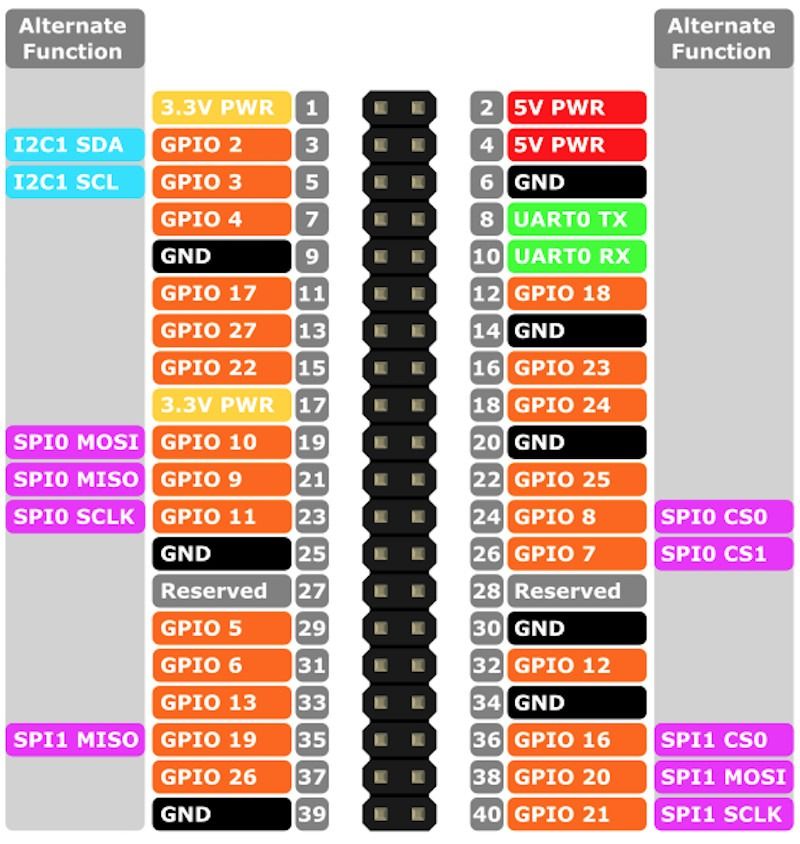

# pi\_cw\_trainer
Hardware and software for a CW (Morse Code) trainer ... Audio and visual.

The design goal is to make a stand-alone CW trainer.

Parts:
* Raspberry Pi -- any generation
  * SD card 4 GB or larger
  * Power supply
* Freenove Super Starter Kit for Raspberry Pi
  * About $22 on Amazon
  * Includes breakout board
  * LED and resistor
  * LCD screen with I2C controller
  * Potentiometer * 2
  * ADC chip via I2C
  * Speaker (passive buzzer with transistor driver)
  * LED matrix screen
  * Pushbuttons 

Software:
* Raspbian OS https://www.raspbian.com
* pigpio library http://abyz.me.uk/pigpio/ or https://github.com/joan2937/pigpio

Installation
* Install raspbian OS
* Install pigpio
  * Need cmake
    sudo apt install cmake
  * From Github:
```
git clone https://github.com/joan2937/pigio
cd pigpio
mkdir build
cd build
cmake ../
make -j4
sudo make install
sudo systemctl start pigpiod.service
sudo systemctl enable pigpiod.service
sudo systemctl status pigpiod.service
cd ~
````
  * Python module
  ```
  pip3 install pigpio
  ```
  
* Enable I2c control
  * sudo raspi-config

## Audio
* Uses [simpleaudio](https://pypi.org/project/simpleaudio/) module
  * Native methods in each platform
  * Monaural, 16 bit resolution
  * Sine wave with [edge smoothing](https://brats-qth.org/training/advanced/trandrec8.htm) 
  * [numpy](https://numpy.org/) for calculating waveform
* Controls: pitch, volume in menu
* Works poorly at high speeds (Dits are lost)

## LED
* Uses GPIO pin from Pi header board:
* 
* Image from [this](https://roboticsbackend.com/raspberry-pi-3-pins/) reference
* GPIO 5 = Header pin 29 is used to LED with 10K resistor to ground

